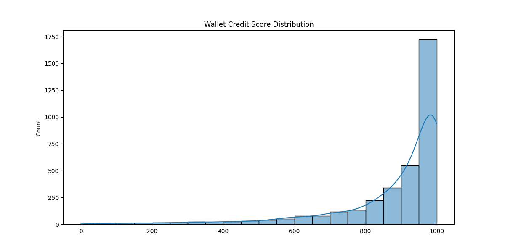

# Aave V2 Credit Score Report

## Score Distribution

## Feature Correlations
|                   |         0 |
|:------------------|----------:|
| borrow_count      | -0.740785 |
| deposit_count     | -0.736857 |
| wallet_age_days   | -0.693001 |
| repay_count       | -0.680466 |
| tx_entropy        | -0.392708 |
| max_usd_amount    | -0.30246  |
| total_txs         | -0.286639 |
| unique_tx_senders | -0.279343 |
| total_usd_volume  | -0.269976 |
| avg_usd_amount    | -0.248243 |
| liquidation_count | -0.214144 |
| borrow_ratio      | -0.152884 |
| redeem_count      | -0.121229 |

## Score Interpretation
| Score Range | Behavior Profile |
|-------------|------------------|
| 900-1000 | Ideal borrowers: Consistent deposits, low liquidation risk |
| 700-900 | Reliable users: Healthy financial ratios |
| 400-700 | Moderate risk: Occasional liquidations |
| 0-400 | High risk: Potential bots or exploit patterns |
